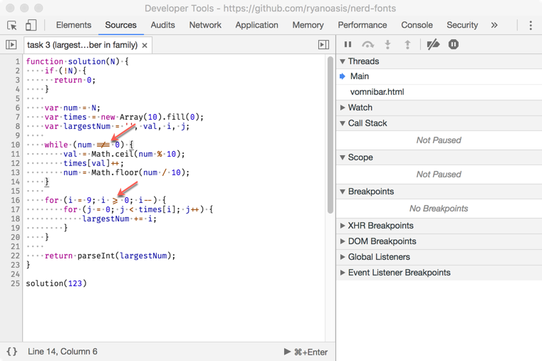

# chrome-devtools-furacode-theme
Use this theme to make the editor in Chrome DevTools Sources tab look better with FuraCode Nerd Font (monospaced font with programming ligatures)


After installing the theme, your editor will look like below


## Install FuraCode Nerd Font
```sh
brew tap caskroom/fonts
brew cask install font-firacode-nerd-font
```

For other installation options, visit [Nerd Fonts](https://github.com/ryanoasis/nerd-fonts#font-installation)

## Install DevTools Theme
1. Clone this repository
2. Open `chrome://flags/#enable-devtools-experiments` and enable `DevTools Experiments`
4. Save and Relaunch Chrome
5. Open DevTools > Settings > Experiments and select `Allow UI` themes experiment
6. Open `chrome://extensions` and enable the `Developer mode` checkbox
8. Click `Load unpacked extension…` button and choose the `chrome-devtools-furacode-theme` directory that you've cloned in step 1
9. Reload DevTools
